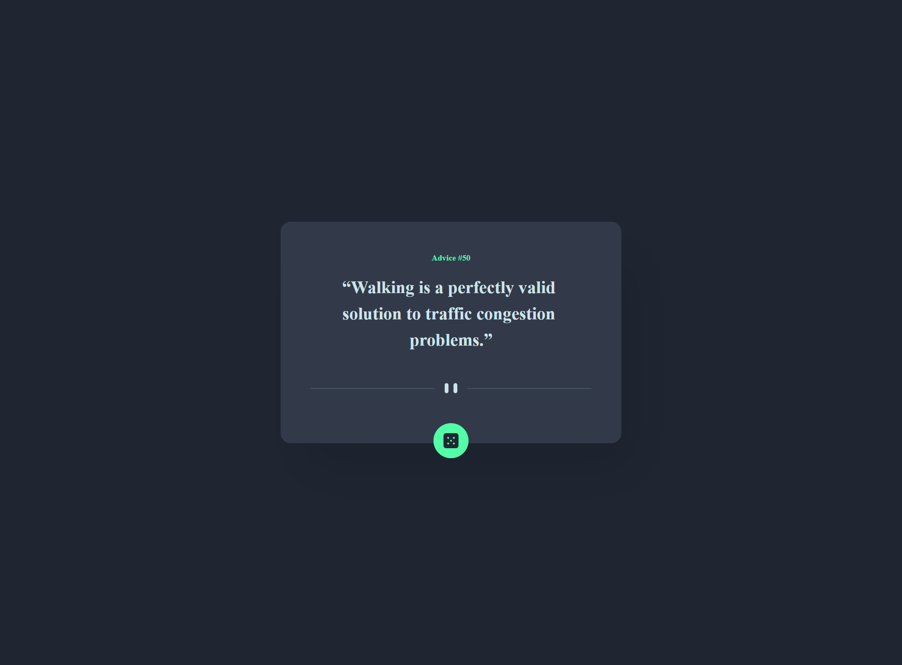
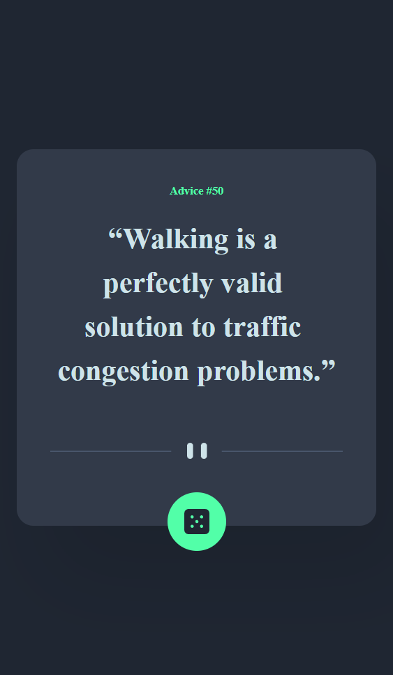

# Frontend Mentor - Advice generator app solution

This is a solution to the [Advice generator app challenge on Frontend Mentor](https://www.frontendmentor.io/challenges/advice-generator-app-QdUG-13db). Frontend Mentor challenges help you improve your coding skills by building realistic projects.

## Table of contents

- [Frontend Mentor - Advice generator app solution](#frontend-mentor---advice-generator-app-solution)
  - [Table of contents](#table-of-contents)
  - [Overview](#overview)
    - [The challenge](#the-challenge)
    - [Screenshot](#screenshot)
    - [Links](#links)
  - [My process](#my-process)
    - [Built with](#built-with)
    - [What I learned](#what-i-learned)
    - [Continued development](#continued-development)
    - [Useful resources](#useful-resources)
  - [Author](#author)

**Note: Delete this note and update the table of contents based on what sections you keep.**

## Overview

### The challenge

Users should be able to:

- View the optimal layout for the app depending on their device's screen size
- See hover states for all interactive elements on the page
- Generate a new piece of advice by clicking the dice icon

### Screenshot

Finished project on a 1440px screen

Finished project on a 375px screen
 

### Links

- Solution URL: [solution on my frontend mentor profile](https://www.frontendmentor.io/profile/zsoltvarju/solutions)
- Live Site URL: [live site on netlify](https://taupe-raindrop-e059f9.netlify.app/)

## My process

### Built with

- Semantic HTML5 markup
- SCSS
- Mobile-first workflow
- Javascript
- GSAP
- AXIOS

### What I learned

Diving into the world of Web APIs was an enlightening experience for me. I mean, who knew that integrating external data into a project could be so invigorating? For this endeavor, I turned to Axios, and I've got to say, it's a straightforward tool, even if you're just getting your feet wet.

Now, let's talk about the GSAP library for a moment. What a game-changer! It's like discovering a new flavor of ice cream. I tried to sprinkle GSAP throughout the project, and here's a bit of what I came up with:

- I jazzed things up with some initial animations, giving the project a dynamic start.
The button? Yep, GSAP's magic makes it have that neat hover effect.
- And those words that playfully shift when you hover? That was a fun challenge. Took a bit of tinkering and, admittedly, a couple of head-scratching moments, but I'm genuinely pleased with the end result.
- All in all, this project was a blend of exploration and learning. It's got me excited for what's next and how I can further mesh creativity with functionality in future endeavors.

That said, I see room for growth in this project. One aspect that nags at me a bit is the fluidity of the container size as the quote updates. I envision a seamless transition, perhaps by gauging the initial size, allowing the quote to modify, then animating to the new size. I've grappled with this challenge, but I'm not one to back down. I plan to revisit and refine, ensuring every detail aligns with my vision.

In sum, this endeavor was a blend of challenge, discovery, and evolution. It has sparked a fervor in me to further hone my skills and push the boundaries of what's possible in upcoming projects.

### Continued development

While I'm quite proud of the progress I've made on this project, there's an aspect I'm keen on refining further—the behavior of the container as the quote refreshes. The ideal scenario in my mind is achieving a seamless transition in size. The process would entail accurately gauging the container's initial dimensions, patiently waiting as the quote alters the layout, and then gracefully animating to this newly adapted size. Admittedly, my initial attempts at this haven't quite hit the mark. Yet, challenges like these fuel my motivation. I have every intention of revisiting this specific feature, diving deep into the problem, and emerging with a solution that aligns perfectly with the polished experience I envision for the users.

### Useful resources

- Kevin Powell's  [blog](https://www.kevinpowell.co/) I highly recommend his channel to anyone who wants to learn web development.
- Josh Comeau's [blog](https://www.joshwcomeau.com/) I also recommend his channel to anyone who wants to learn web development.
- Dave Gray's [blog](https://daveceddia.com/) I also recommend his channel to anyone who wants to learn web development.
- [MDN](https://developer.mozilla.org/en-US/) I think this is the best place to look up things.

Some pages i wish i could find earlier:
- [CSS Tricks](https://css-tricks.com/)
- [CSS Cheat Sheet](https://htmlcheatsheet.com/css/)
- [HTML Cheat Sheet](https://htmlcheatsheet.com/)
- [JS Cheat Sheet](https://htmlcheatsheet.com/js/)
- [CSS Grid Cheat Sheet](https://grid.malven.co/)
- [Flexbox Cheat Sheet](https://flexbox.malven.co/)

## Author

- Frontend Mentor - [@zsoltvarju](https://www.frontendmentor.io/profile/zsoltvarju)
- LinkedIn - [Zsolt Varjú](https://www.linkedin.com/in/zsolt-varj%C3%BA-019419234/)
